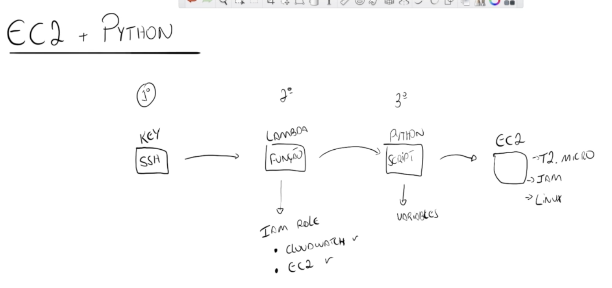

<h3>Resume</h3>

Para este laboratório não se esqueça de:

<ul>
<li>Verificar a role e suas permissões para o CloudWatch e EC2;</li>
<li>Aumentar o valor do timeout da lambda function para 1 min para caso sua função demore na execução;</li>
<li>Declarar as variáveis e seus values na aba <i>Configuration</i> opção: <i>Environment variables</i></li>
<li> 🚨 Ao final dos estudos: <b>Desprovisionar e excluir todos os recursos gerados nesse laborátório para não incorrer em custos na sua conta da AWS;</b></li>
</ul>

<figure>

<figcaption> Timeline do Laboratório</figcaption>
</figcaption>