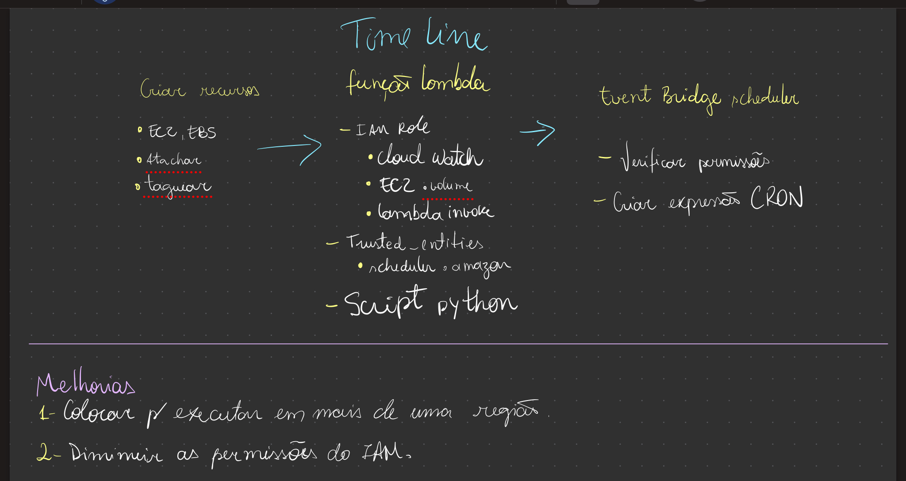

<h3>Resume</h3>

Para este laboratório não se esqueça de:

<ul>
<li>Criar a instância para attachar os volumes;</li>
<li>Verificar a role e suas permissões para o CloudWatch, EventBridge e EC2;</li>
<li>Criar o agendamento da periodicidade de execução da sua lambda function no EventBridge com a expressão CRON:<b> 0 20 1,15 * ? * </b> = <b>Rodar dia 1 e dia 15 do mês.</b> </li>
<li>Aumentar o valor do timeout da lambda function para 1 min para caso sua função demore na execução;</li>
<li>Editar 'Trust relationships' para que o EventBridge assuma a role</li>
<li> 🚨 Ao final dos estudos: <b>Desprovisionar e excluir todos os recursos gerados nesse laborátório para não incorrer em custos na sua conta da AWS;</b></li>

</ul>

<figure>

<figcaption> Timeline do Laboratório</figcaption>
</figcaption>