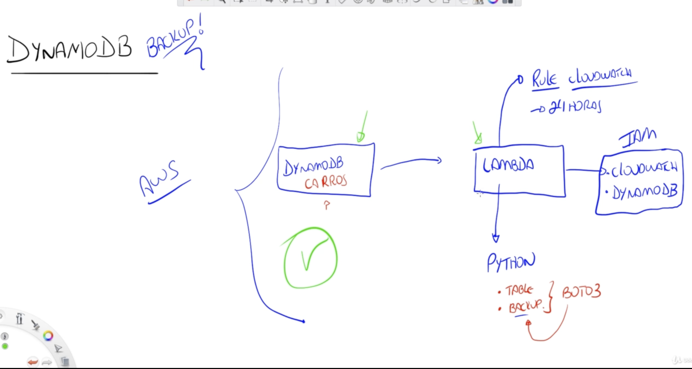

<h3>Resume</h3>

Para este laboratório não se esqueça de:

<ul>
<li>Criar a tabela no DynamoDb para que o backup possa ser realizado;</li>
<li>Verificar a role e suas permissões para o CloudWatch, EventBridge e o Dynamodb;</li>
<li>Aumentar o valor do timeout da lambda function para 1 min para caso sua função demore na execução;</li>
<li>Declarar a variável <i>TableName</i> e o <i>value</i> correspondente ao nome da sua tabela no configure input da Lambda function.</li>
</ul>

<figure>

<figcaption> Fluxo de criação do Laboratório</figcaption>
</figcaption>